# Biocentral - Getting Started Guide

Welcome to Biocentral! Biocentral is a bioinformatics platform that allows you to work with your data
in a simple and intuitive way. In addition, you can perform various analyses on your data, create embeddings
from protein language models and even train your own models.

This guide will explain the basic features of Biocentral as a hands-on tutorial. So let's get started!

## Installation

Download and install the latest version for your operating system
from [GitHub](https://github.com/biocentral/biocentral/releases), or use it directly in the
[browser](https://app.biocentral.cloud).

## First steps: Loading an example dataset and performing basic analyses

After opening biocentral, the following screen will appear:

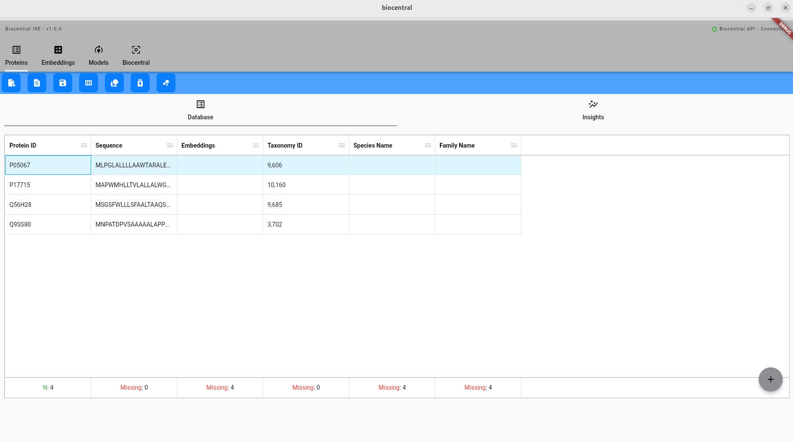

In the upper tab bar, you find the different modules of Biocentral. Currently, the `Proteins` module is active:

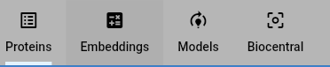

Below that, you can find the available commands for the selected module:

Let's start by loading an example dataset:

Select the Amylase dataset (1) and click on the "Import" button (2).
The dataset contains **single and double mutations** with normalized **expression levels** of
the [1UA7](https://www.rcsb.org/structure/1UA7) amylase protein.

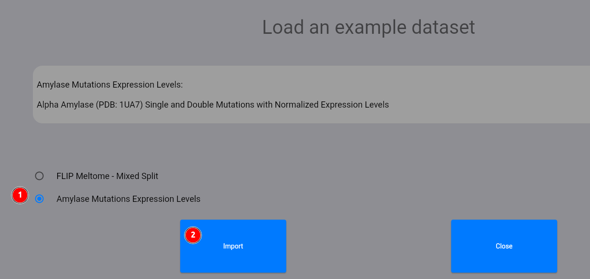

Now, you should have been returned to the protein module with the loaded dataset. Let us analyze the distribution
of the expression levels (TARGET column). To do this, click on the following button:

Then, select the target column:

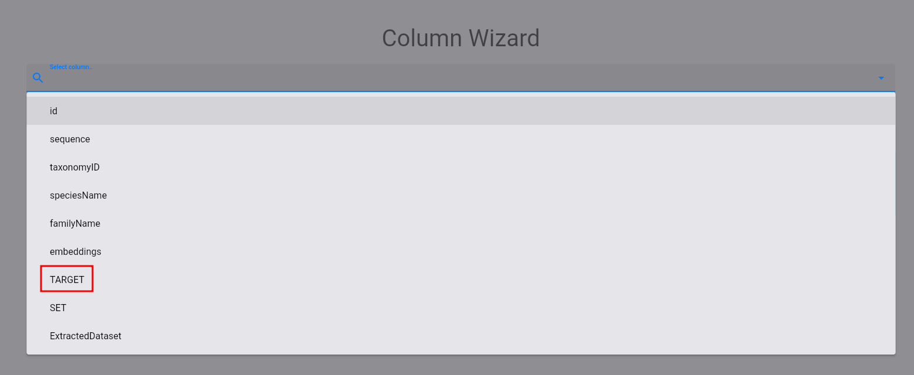

The following plot and statistics should appear:

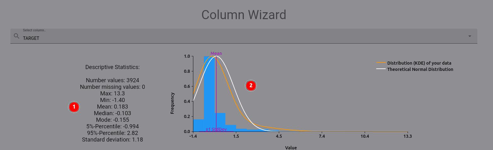

On the left (1), you find descriptive statistics for the expression levels. On the right (2), you can see the
distribution of the expression levels, plotted against a theoretical normal distribution based on the mean and
standard deviation of the expression levels. As you can see, there are some high-value outliers in the dataset.
Let's remove them by selecting the `removeOutliers` operation and using the `byStandardDeviation` method:

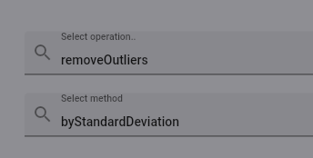

A new plot and statistics should appear below the original column display:

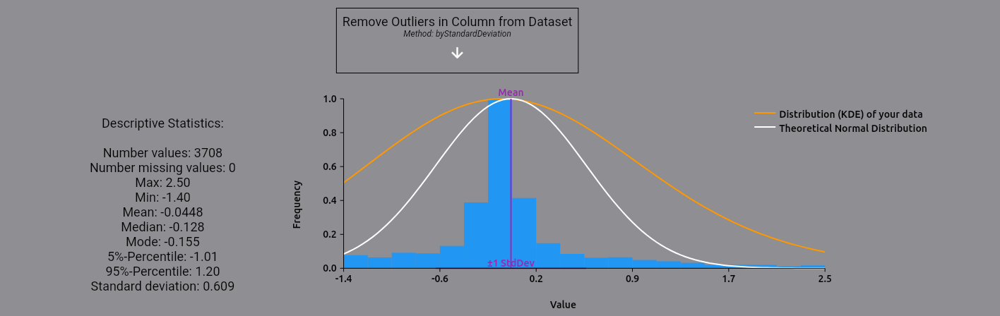

Your original dataset has not been modified yet! This allows you to perform multiple operations on your data
without having to reload it, and thus play around with your data analysis. For now, we apply the modifications
to our dataset in the same column, effectively removing the outliers:

## Computing embeddings for the dataset

After the initial analysis, now let us compute embeddings for the dataset. For the sake of the tutorial,
we will use `one_hot_encoding`, a simple method that encodes each protein sequence as a one-hot vector. Feel free
to try out other methods, such as protein language models like ESM-2 or ProtT5!

First, select the `embeddings` module:

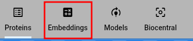

Then, click on the `compute` button:

In the appearing dialog, select the `one_hot_encoding` method (1), select `perSequence` embeddings (2)
and click on the `Calculate` button:

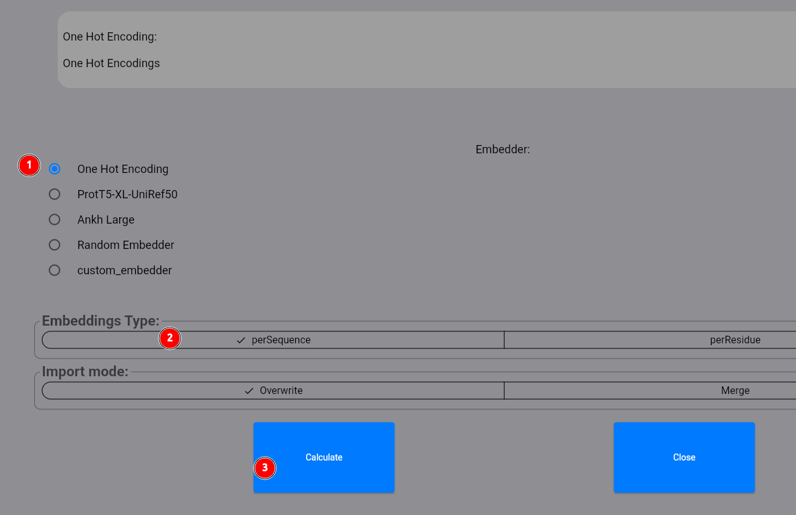

Your embeddings are now computed via an available _biocentral server_.
In the lower bar of the screen, you should see a progress bar indicating the computation progress. This bar
appears for all longer running commands so that you can track the progress of the computation:

Now select the computed embeddings:

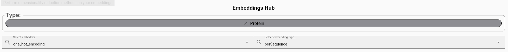

In the lower part of the screen, you can investigate the embeddings for each protein in more detail. Usually,
you would now want to look at a projection of the embeddings onto a 2D space, for example using the UMAP algorithm.
This gives you a better feeling for the structure of the protein space and how well the embeddings capture your
protein features of interest.
This can be done by selecting the `projection` command:

In the following dialog, select our `one_hot_encoding` method for the `perSequence` embeddings (1, 2). Then select
`umap` (3). You can configure custom parameters for the UMAP algorithm (4) if you want,
and then click on the `Calculate` button (5):

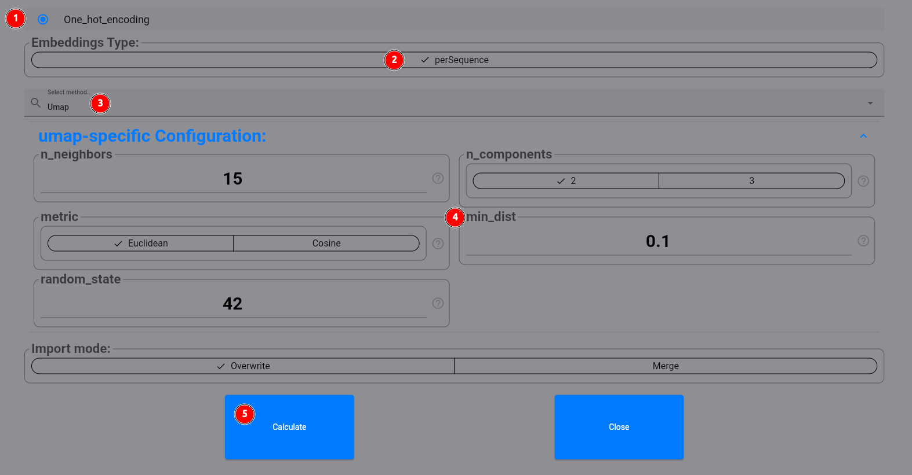

The resulting projection should look like this:

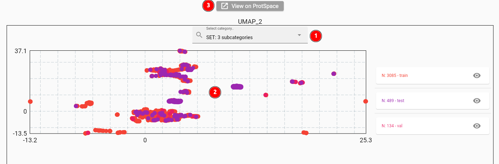

When selecting the set column to color the points by (1), you will see quite some overlap between the sets (2). This
is expected for `one_hot_encoding` embeddings on our dataset, as the `perSequence` vectors differ only slightly
for single or double mutations. You can also use the [ProtSpace](https://github.com/tsenoner/ProtSpace) tool
to explore the protein space more deeply (3).

## Training a model to predict expression levels

Now let's see if our embeddings can be used to predict expression levels effectively. Start by selecting the `Models`
module:

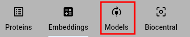

Select the `train` command:

In the appearing dialog, first select the `Protein` dataset (1). Next, we select the training protocol:
We want to predict a value for each protein. Thus, we have a `sequence` (2) to `value` (3) mapping.
Then select the `one_hot_encoding` embedder as before (4).

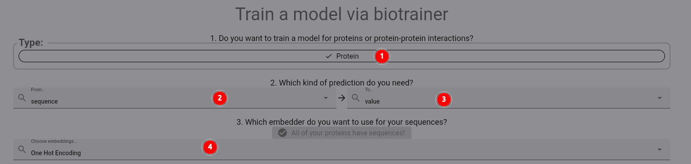

Now, we select our target column (1) and the set column which is already pre-calculated for us (2). As the model,
we select `FNN`, which gives us a shallow fully connected neural network (3). Finally, first `verify` the config
and the start the training process by the respective button (4).

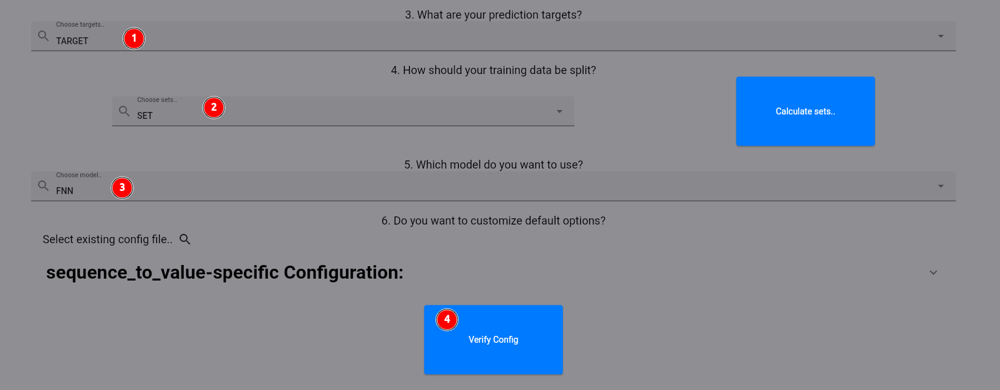

After training is finished, you should see a new model in the list of models:

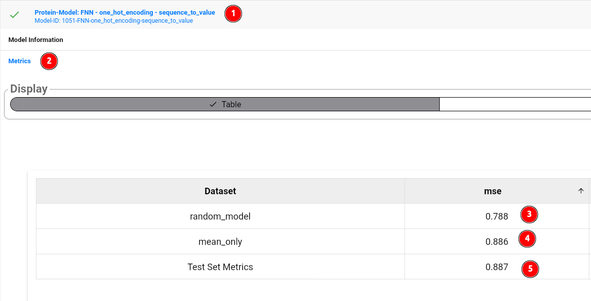

The model card shows the model id and general information about the model (1). To look at the performance metrics,
click on the model card, then select metrics (2). As you can see, the model itself (5)
does not outperform a random, untrained model (3),
or even predicting the mean value of the training set target column (4). Thus, we could try to use more sophisticated
representations of our sequences, such as provided by protein language models. Feel free to try out other models!
You can compare their results using the model comparison tool:

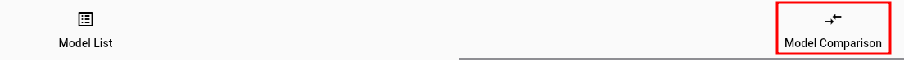

## Conclusion and where to go from here

Thank you for following this guide for biocentral! As a next step, check out the more detailed documentation
for the different modules and commands. You can find an overview [here](modules.md). Please also consider
starring biocentral on [GitHub](https://github.com/biocentral/biocentral) to stay up to date with the latest features!
If biocentral is useful for your research,
please cite the [biocentral paper](https://doi.org/10.1101/2025.11.21.689449).
